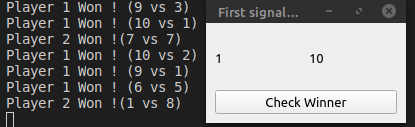

# Utilisation de git

```bash
git add myfiles
git commit -m "commit"
git push origin main
```

Si errors lors du push:
```bash
git pull
```
Une fenêtre souvre alors (vi), faire ":q!"

## batailleLikeGame
Stupide jeux comme Bataille ou on compare juste des valeurs et on dit qui a la plus grosse.

### TO DO
- [ ] Soigner la 'mise en page'
- [ ] Afficher qui gagne sur la fenêtre et non pas dans la console.
- [ ] Correction quand équalité.
- [ ] Valeurs = jeux de carte
- [ ] Remplacer valeurs par des images de cartes
- [ ] Cartes non aléatoires mais un paquet de carte distribué, chaque victoire donne la carte au gagnant et la fait perdre au perdant.
- [ ] Init les widgets dans init et leurs donner des valeurs dans run (Je sais pas si c'est la manière de faire de pyQT5)
- [ ] Nom des joueurs modifiables