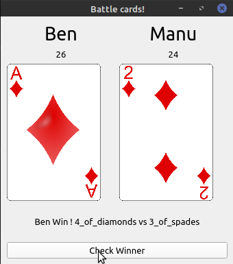

# batailleLikeGame
Stupide jeux comme Bataille ou on compare juste des valeurs et on dit qui a la plus grosse.

## Link
Rules   
https://bicyclecards.com/how-to-play/war/

Cards Asset    
https://code.google.com/archive/p/vector-playing-cards/downloads

### TO DO
- [ ] Gestion des égualités ! (Bataille)
- [X] Soigner la 'mise en page'
- [X] Afficher qui gagne sur la fenêtre et non pas dans la console.
- [X] Valeurs = jeux de carte
- [X] Remplacer valeurs par des images de cartes
- [X] Cartes non aléatoires mais un paquet de carte distribué, chaque victoire donne la carte au gagnant et la fait perdre au perdant.
- [ ] Init les widgets dans init et leurs donner des valeurs dans run (Je sais pas si c'est la manière de faire de pyQT5)
- [ ] Nom des joueurs modifiables